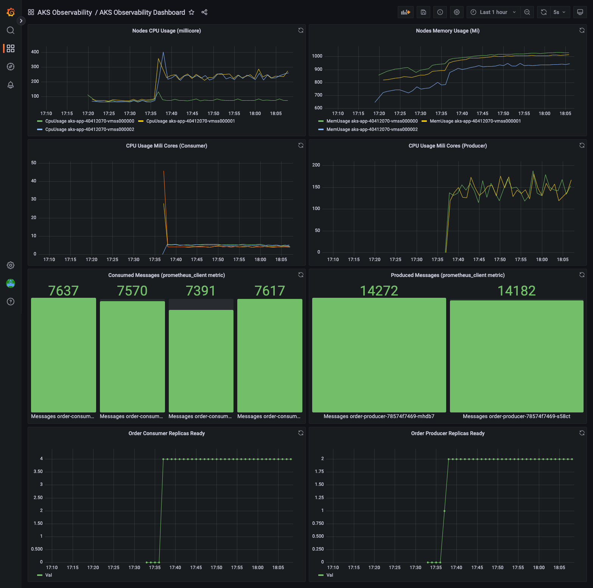

## About this project

As we move to microservices based architectures, having a comprehensive observability solution is key to have highly available and reliable applications. But unfortunately self-managed observability solutions such as prometheus and grafana are difficult to operate, specially when you need longer retention times.

This repository shows how to leverage **Azure Monitor Container Insights** with **Prometheus Integration** together with **Azure Managed Grafana (Preview)** as a complete managed observability solution for workloads running on AKS, removing the operational costs and hassle that comes from maintaining a self-managed solution.

### Create the infrastructure using terraform

```
$ cd terraform
$ az login
$ terraform init
$ terraform plan -var 'aks-observability-rg=<resource_group_name>'
$ terraform apply -var 'aks-observability-rg=<resource_group_name>'
$ az aks get-credentials --name aks-observability --resource-group <resource_group_name>
```

### Enable Prometheus metrics collection 

```
$ cd ..
$ kubectl apply -f container-azm-ms-agentconfig.yaml
```

### Build the order-app images using ACR Tasks

```
$ cd apps/order-app
$ az acr build -f Dockerfile-consumer -r <acr_name> --image order-consumer:v1 .
$ az acr build -f Dockerfile-producer -r <acr_name> --image order-producer:v1 .
```

### Edit ```order-consumer.yaml``` and ```order-producer.yaml``` to set the image registry URL from terraform's output and deploy them on AKS

```
$ kubectl apply -f order-consumer.yaml -f order-producer.yaml
```

### Import the AKS Observability Dashboard

```
$ cd ../..
$ az grafana folder create --title "AKS Observability" -n aks-observability -g <resource_group>
$ export LOG_ANALYTICS_WORKSPACE_ID=$(az monitor log-analytics workspace show -n aks-observability -g <resource_group> -o tsv --query id)
$ az grafana dashboard import --folder "AKS Observability" --definition "$(envsubst '$LOG_ANALYTICS_WORKSPACE_ID' < AKS-Observability-Dashboard.json.template)" -n aks-observability -g <resource_group>
```

### Get the Azure Managed Grafana URL and navigate to the AKS Observability Dashboard

```
$ az grafana show -n aks-observability -g <resource_group>  --query properties.endpoint -o tsv
```

Navigate to _Dashboards > AKS Observability > AKS Observability Dashboard_, you should see something like this:



This dashboard shows metrics collected from Container Insights and fetched using Grafana's Azure Monitor Datasource (Monitor Logs using [KQL](https://docs.microsoft.com/en-us/azure/data-explorer/kusto/query/tutorial?pivots=azuremonitor)), including prometheus metrics implemented using [prometheus/client_python](https://github.com/prometheus/client_python) in ```app/order-app/order-consumer.py``` and ```app/order-app/order-producer.py```. Feel free to explore the queries by editing each panel.

### Check the application logs

```
$ LOG_QUERY="KubePodInventory | 
extend PodLabel = todynamic(PodLabel)
| where PodLabel[0].app == 'order-consumer'
| project ContainerID
| join kind=rightsemi (    
 ContainerLog 
 | project TimeGenerated, ContainerID, LogEntry
 | where TimeGenerated > ago(10m)
)
on ContainerID"
$ WORKSPACE_GUID=$(az monitor log-analytics workspace show -n aks-observability -g <resource_group> --query customerId -o tsv) 
$ az monitor log-analytics query -w $WORKSPACE_GUID --analytics-query "$LOG_QUERY" -o tsv
```

Reference:

https://azure.microsoft.com/en-us/services/managed-grafana/

https://grafana.com/docs/grafana/latest/datasources/azuremonitor/

https://docs.microsoft.com/en-us/azure/azure-monitor/containers/container-insights-overview

https://docs.microsoft.com/en-us/azure/azure-monitor/containers/container-insights-prometheus-integration